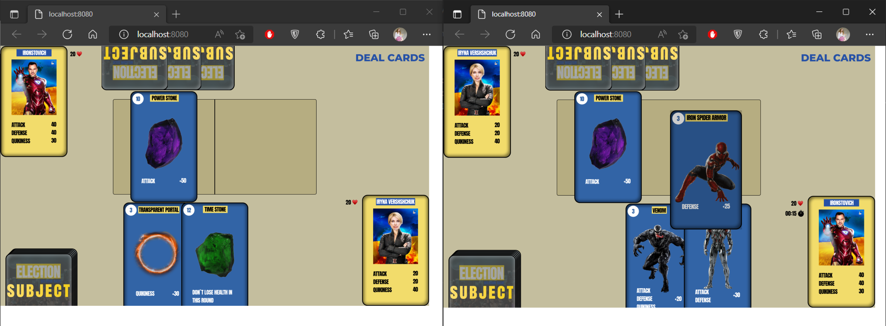

# Race01 Election - Welcome Back!

Marvel game about the real Ukrainian SuperHeroes




## Description

Election is a simple (enough) card game, goal of which is to overcome your opponent and not lose your own life.

To play the Election you have to get Election Account (does not really force you to vote, but who knows ʘ‿ʘ)

Once you register or login into your profile, you can start fighting with your friend (｡◕‿◕｡) or enemy( ఠൠఠ )ﾉ (no bots! do not forget about a real people, ok?)

The next issue is a process of game. When your friend enters a game, you both are able to deal your own cards (press active button 'DEAL CARDS')
'First come, first go'? Exactly. One of you who connected first will attack first. 

Let the fight begin!! 

Ough, every player receives one (1) player card and three (3) subject cards that could help him to get win.

In each round you can use only one subject card, so think carefuly and do not lose you chance to kick your opponent a*s ʕʘ̅͜ʘ̅ʔ

## Getting Started

### Dependencies

Well, to start a server and game you have to get installed Node.js
```
npm install -g npm
```
Also express does not hurt 
```
npm i express
```
Ok, all the install are here
```
npm install -g-save npm, express, express-thymeleaf, shuffle-array, bcrypt, cors, express-session, mysql2, body-parser, cookie-parser, nodemailer, phaser3-webfont-loader
npm install webpack-dev-server --save-dev
```
and the other staff that could make your terminal type an error

### Installing

In order to install just clone this repo and enjoy 

### Executing program

Running a program is an important issue, so
to run a program you should go to folder client/ and run the folowing code
```
cd client
npm run start
```
and in your main folder also run
```
npm run start
npm run serve
```

### WARNING
If you get a database problem, while trying to sign up or log in, you should create your user in mysql2 workbench (yes, what you wanted instead??)
there you should run the folowwing script:
```
CREATE DATABASE IF NOT EXISTS myapp;
CREATE USER IF NOT EXISTS 'username'@'localhost' IDENTIFIED BY 'securepass';
GRANT ALL PRIVILEGES ON * . * TO 'username'@'localhost';
ALTER USER 'username'@'localhost' IDENTIFIED WITH mysql_native_password BY 'securepass';
flush privileges;
```

now you can enjoy signing up, logging in and playing an amazing game

## Help

If you have any trouble, please connect us

## Authors

[melehova](https://github.com/melehova)

[arimarianna](https://github.com/arimarianna)

## Version History

* 0.2
    * Initial Release
* 0.1
    * You have better do not know :)
